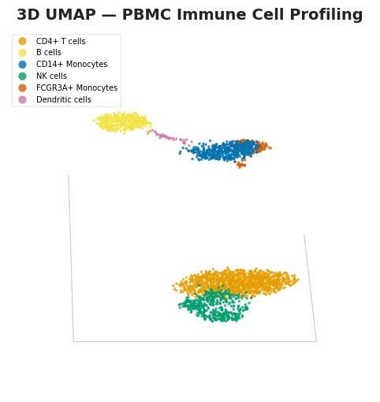
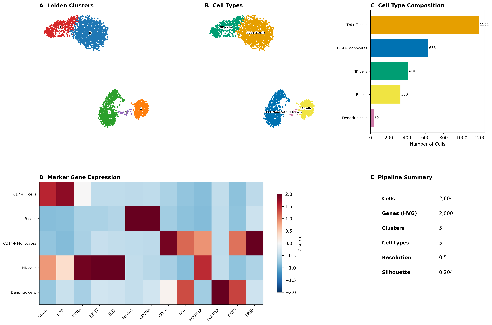

# Single-Cell RNA-seq Immune Cell Profiling

[](https://github.com/Ekin-Kahraman/single-cell-rnaseq-immune-profiling/actions/workflows/ci.yml)
[](LICENSE)
[](https://www.python.org/)

End-to-end single-cell RNA-seq analysis pipeline in Python using [scanpy](https://scanpy.readthedocs.io/). Doublet detection, quality control, normalisation, dimensionality reduction, clustering with automated resolution selection, marker-based cell type annotation, PAGA trajectory inference, and T cell subclustering on human peripheral blood mononuclear cells.

<p align="center">
  
</p>

<details>
<summary>Static publication figure</summary>



**Panel A** — UMAP coloured by unsupervised Leiden clusters. **Panel B** — Same embedding coloured by assigned cell type. **Panel C** — Cell type proportions. **Panel D** — Z-scored expression of canonical marker genes per cell type (red = high, blue = low). **Panel E** — Summary statistics.
</details>

## Dataset

**10X Genomics PBMC 3k** — 2,700 peripheral blood mononuclear cells from a healthy donor, sequenced on the Chromium platform. This is the standard benchmark dataset used across [scanpy](https://scanpy-tutorials.readthedocs.io/en/latest/pbmc3k.html), [Seurat](https://satijalab.org/seurat/articles/pbmc3k_tutorial.html), and other single-cell frameworks.

- **Direct download**: [filtered gene-barcode matrices](https://cf.10xgenomics.com/samples/cell-exp/1.1.0/pbmc3k/pbmc3k_filtered_gene_bc_matrices.tar.gz) (5.9 MB)
- **Reference**: Zheng et al. (2017) [Massively parallel digital transcriptional profiling of single cells](https://doi.org/10.1038/ncomms14049). *Nature Communications* 8, 14049.

## Workflow

```
PBMC 3k (10X Genomics, 2,700 cells)
    │
    ▼
 01 QC ──────────── Scrublet doublet detection → filter: 200 < genes < 2500, mito < 5%
    │                (36 doublets detected, 34 removed)
    ▼
 02 Preprocess ──── Normalise (10k), log1p, 2000 HVGs, regress, scale
    │
    ▼
 03 Reduce ──────── PCA (40 PCs) → kNN graph → UMAP (random_state=42)
    │
    ▼
 04 Cluster ─────── Leiden at 5 resolutions → silhouette selection (≥5 clusters)
    │
    ▼
 05 Annotate ────── Wilcoxon DE → score against PBMC marker signatures → 5 cell types
    │
    ▼
 06 Trajectory ──── PAGA graph abstraction → diffusion pseudotime (rooted in CD14+ mono)
    │
    ▼
 07 Subcluster ──── T cell compartment → resolve CD4+ (47.5%) and CD8+ (52.5%)
    │
    ▼
 08 Figures ─────── Multi-panel publication figure (PNG 300 DPI + PDF vector)
```

## Pipeline

| Step | Script | What it does |
|------|--------|--------------|
| 01 | `01_load_and_qc.py` | Download PBMC 3k, Scrublet doublet detection, QC metrics, filter low-quality cells and doublets |
| 02 | `02_preprocess.py` | Normalise to 10k counts/cell, log-transform, select 2,000 HVGs, regress out confounders, scale |
| 03 | `03_reduce_dimensions.py` | PCA (40 components), k-nearest neighbour graph, UMAP embedding |
| 04 | `04_cluster.py` | Leiden clustering at 5 resolutions (0.3–1.2), silhouette evaluation, select best with ≥5 cluster floor |
| 05 | `05_annotate_cell_types.py` | Wilcoxon rank-sum DE, score clusters against curated PBMC signatures, assign cell types |
| 06 | `06_trajectory.py` | PAGA partition-based graph abstraction, PAGA-initialised UMAP, diffusion pseudotime |
| 07 | `07_t_cell_subclustering.py` | Extract T cell compartment, subcluster, resolve CD4+/CD8+ via marker scoring |
| 08 | `08_publication_figures.py` | Multi-panel figure with UMAP, composition, marker heatmap, summary (PNG + PDF) |

All scripts are in `scripts/`. Each reads the previous step's `.h5ad` output from `results/`.

## Results

### Cell Type Composition

| Cell Type | Cells | % | Key Markers |
|-----------|-------|---|-------------|
| CD4+ T cells | 1,192 | 45.8 | CD3D, IL7R |
| CD14+ Monocytes | 636 | 24.4 | CD14, LYZ |
| NK cells | 410 | 15.7 | NKG7, GNLY |
| B cells | 330 | 12.7 | MS4A1, CD79A |
| Dendritic cells | 36 | 1.4 | FCER1A, CST3 |

2,604 cells retained after QC and doublet removal (from 2,700 raw). Clustering selected resolution 0.5 (5 clusters, silhouette 0.204).

### T Cell Subclustering

Subclustering the T cell compartment (1,192 cells) resolves the CD4+/CD8+ boundary that is not visible at the global clustering level:

| Subtype | Cells | % of T cells |
|---------|-------|---|
| CD8+ T | 626 | 52.5 |
| CD4+ T | 566 | 47.5 |

The near-equal split is consistent with healthy donor PBMCs. CD8+ T cells were assigned by scoring CD8A/CD8B/GZMK/GZMA against IL7R/CD4/TCF7/LEF1.

### Trajectory Inference

PAGA connects CD14+ monocytes → dendritic cells (the myeloid differentiation axis) and reveals the T/NK cell cluster neighbourhood in UMAP space. Diffusion pseudotime, rooted in CD14+ monocytes, orders cells along the monocyte-to-DC trajectory.

### Biological Interpretation

The dominance of CD4+ T cells (46%) is expected in healthy donor PBMCs. Dendritic cells are a rare population (1.4%), correctly resolved as a distinct cluster despite low cell count. The monocyte population is predominantly classical (CD14+); nonclassical (FCGR3A+) monocytes were not resolved as a separate cluster at resolution 0.5 — they likely merge with the classical monocyte cluster. This is consistent with the resolution-sensitivity of FCGR3A+ monocyte separation observed in the literature.

Silhouette scores in single-cell data are typically low due to continuous rather than discrete cell states; the metric is used here for relative comparison between resolutions, not as an absolute quality measure.

## Quick Start

```bash
git clone https://github.com/Ekin-Kahraman/single-cell-rnaseq-immune-profiling.git
cd single-cell-rnaseq-immune-profiling
pip install -e .
python run_pipeline.py            # full pipeline (~38s)
python run_pipeline.py --from 6   # resume from trajectory step
```

## Testing

```bash
pip install -e ".[dev]"
pytest -v
```

7 tests covering QC filtering, normalisation, HVG selection, clustering, and marker gene validation. CI runs on Python 3.10, 3.11, and 3.12.

## Design Decisions

- **Doublet detection** — Scrublet integrated before QC filtering. 36 doublets detected (1.3%), 34 removed after other QC filters. Following [Luecken & Theis (2019)](https://doi.org/10.15252/msb.20188746) best practices.
- **Automated annotation** — Clusters scored against curated PBMC marker gene sets rather than manual inspection. Reproducible and removes subjective judgement.
- **Multi-resolution clustering** — Leiden at 5 resolutions with silhouette evaluation and a biological floor of ≥5 clusters.
- **Trajectory inference** — PAGA provides a principled graph abstraction of cell-type connectivity. Diffusion pseudotime orders cells along differentiation axes.
- **T cell subclustering** — Resolves CD4+/CD8+ populations that share CD3D/CD3E expression and cannot be separated at global clustering resolution.
- **Colourblind-friendly palette** — Okabe-Ito colours throughout.
- **Reproducible seeds** — `random_state=42` for UMAP, Leiden, Scrublet, and silhouette sampling.
- **Dual-format figures** — PNG (300 DPI) for web, PDF (vector) for publication submission.

## Limitations

- **Single-sample dataset.** Multi-sample analyses would require batch correction (Harmony, scVI, or BBKNN).
- **`regress_out` is debatable.** Used here following the original scanpy tutorial, but Luecken & Theis (2019) suggest regression may overcorrect for well-filtered cells.
- **No pathway enrichment.** Gene set enrichment (via decoupler or GSEApy) would connect cell types to functional programmes. Planned as a future addition.
- **FCGR3A+ monocytes not resolved.** At resolution 0.5, nonclassical monocytes merge with the CD14+ cluster. Higher resolution or targeted subclustering would separate them.

## Licence

MIT
